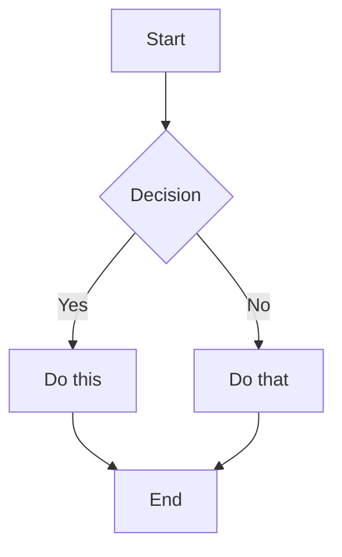

# Markdown Guide

En fullstendig referanse for alt du kan skrive i Meridian.

---

## Tekstformatering

**Fet** — `**bold**`
*Kursiv* — `*italic*`
~~Gjennomstreking~~ — `~~strikethrough~~`
==Utheving== — `==highlight==`
`Innebygd kode` — `` `code` ``

---

## Overskrifter

```
# H1 — Sidetittel
## H2 — Seksjon
### H3 — Underseksjon
```

---

## Lister

Uordnet:
- Element én
- Element to
  - Nestet element

Ordnet:
1. Første
2. Andre
3. Tredje

---

## Sjekklister

- [ ] Oppgave ikke utført
- [x] Oppgave fullført
- [ ] En annen oppgave

Sjekklister vises i [[Tasks & Checklists]]-panelet.

---

## Callouts

> [!NOTE]
> En informerende callout.

> [!TIP] Egendefinert tittel
> Teksten etter typen blir callout-overskriften.

> [!WARNING]
> Noe å passe på.

> [!DANGER]
> Kritisk informasjon.

> [!SUCCESS]
> Bekreftelse eller vellykket tilstand.

> [!QUESTION]
> Åpne spørsmål og ting å undersøke.

---

## Kodeblokker

```typescript
function greet(name: string): string {
  return `Hello, ${name}!`
}
```

```python
def fibonacci(n: int) -> list[int]:
    a, b = 0, 1
    result = []
    for _ in range(n):
        result.append(a)
        a, b = b, a + b
    return result
```

---

## Tabeller

| Kolonne A | Kolonne B | Kolonne C |
|----------|----------|----------|
| Celle 1   | Celle 2   | Celle 3   |
| Celle 4   | Celle 5   | Celle 6   |

---

## Lenker

Ekstern: [Meridian on GitHub](https://github.com/bvsmma/meridian)

Wiki-lenke: [[Getting Started]]

Wiki-lenke med egendefinert tekst: [[Getting Started|Start her]]

---

## Diagrammer (Mermaid)



---

## Frontmatter

```yaml
---
title: My Note
tags: project, research
date: 2026-05-22
---
```

Tagger vises i Tagger-panelet i sidepanelet.
